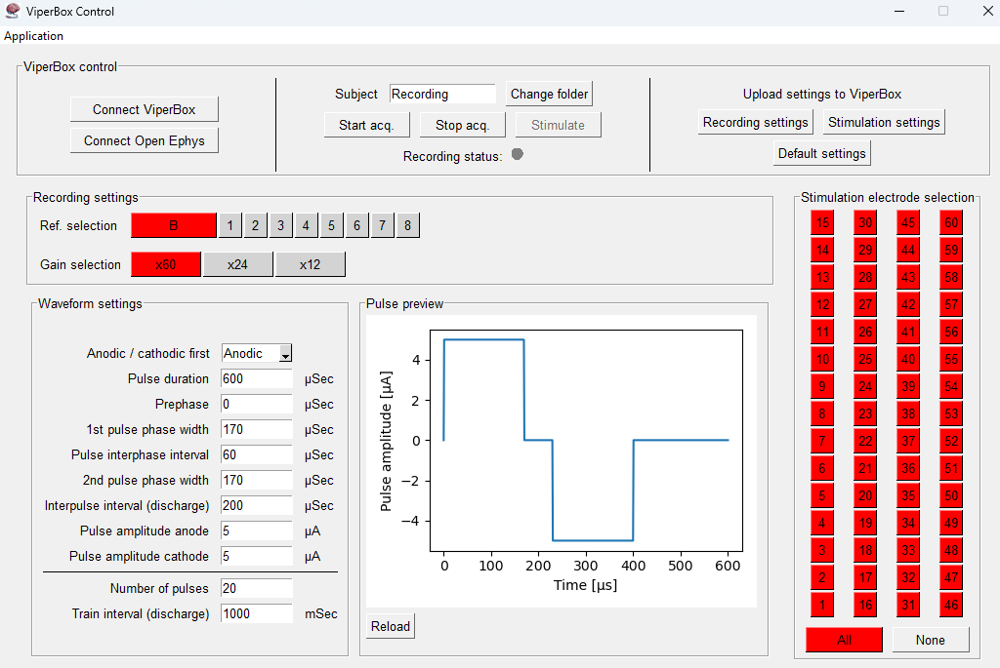
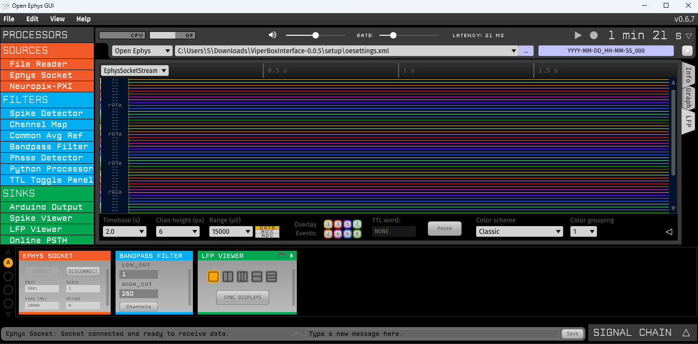
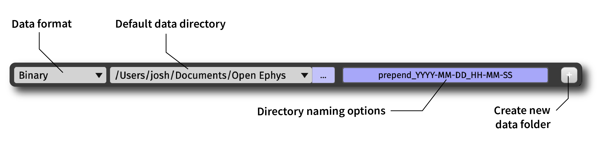
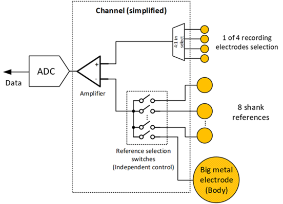
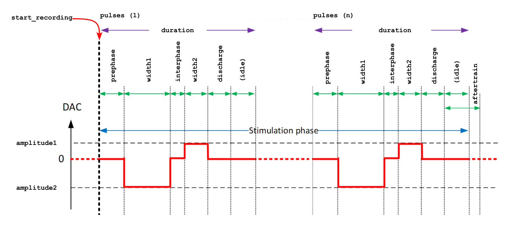
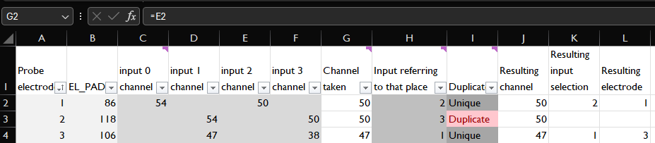
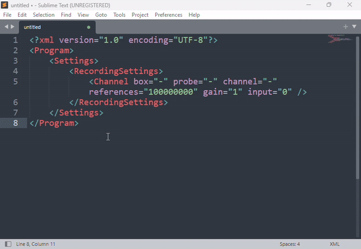
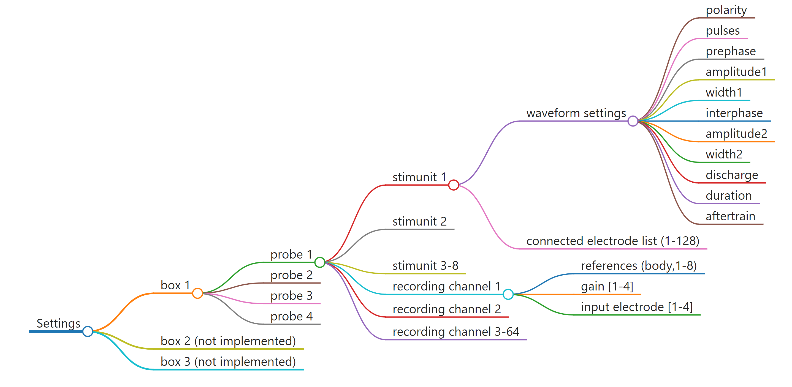

# :brain: ViperBoxInterface

> ViperBoxInterface is a piece of software that streamlines interaction with the ViperBox developed for the NeuraViPeR project.
> It sends recording data to [Open Ephys](#open-ephys).


<!-- toc-start -->

## :books: Table of Contents

<!-- START doctoc generated TOC please keep comment here to allow auto update -->
<!-- DON'T EDIT THIS SECTION, INSTEAD RE-RUN doctoc TO UPDATE -->

- [:desktop_computer: Using the GUI](#desktop_computer-using-the-gui)
  - [Starting up](#starting-up)
    - [ViperBox Control usage](#viperbox-control-usage)
    - [Open Ephys GUI usage](#open-ephys-gui-usage)
  - [Recording](#recording)
- [:gear: Settings](#gear-settings)
  - [Gain settings](#gain-settings)
  - [References and input settings](#references-and-input-settings)
  - [Choosing probe electrodes](#choosing-probe-electrodes)
- [:question: (F)AQ](#question-faq)
- [:robot: Using the API](#robot-using-the-api)
- [:hammer_and_wrench: Overview of ViperBox settings](#hammer_and_wrench-overview-of-viperbox-settings)
- [:memo: Changing settings through XML scripts](#memo-changing-settings-through-xml-scripts)
  - [RecordingSettings](#recordingsettings)
  - [Stimulation settings](#stimulation-settings)

<!-- END doctoc generated TOC please keep comment here to allow auto update -->

<!-- toc-end -->

## :desktop_computer: Installation and usage

To be able to use this software, you need to have a computer with Windows 10 or newer installed. To do experiments, you also need a ViperBox.

### Installation

To install the software, please follow these steps:
- Install Anaconda from [here](https://www.anaconda.com/download/success)
- Install Open Ephys from [here](https://open-ephys.org/gui)
- Install the ViperBoxInterface:
    - Open an anaconda prompt by pressing Start and typing "Anaconda Powershell Prompt" and pressing enter
    - Navigate to the folder where you want to download the software by typing `cd <path to the folder>`
    - Clone the repository by running `git clone git@github.com:sbalk/ViperBoxInterface.git`
    - Navigate to the folder by running `cd ViperBoxInterface`
    - Create a new conda environment by running `conda create --name viperbox python=3.11`
    - Activate the environment by running `conda activate viperbox`
    - Install conda with `conda install -c conda-forge unidep -y`
    - Run `unidep install .`
- To create a desktop shortcut, navigate to the `setup` folder and right-click the `create_shortcut.ps1` file and select "Run with PowerShell"

### Starting up
- Use the dekstop shortucut you created
- OR If you don't have a shortcut, you can start the software with the following steps:
    - Open an Anaconda prompt
    - Activate the environment by running `conda activate viperbox`
    - Navigate to the folder by running `cd viperboxinterface`
    - Run the software by running `uvicorn server:app`

### ViperBox GUI

When starting the software, the gui will start as well. In the background, the server is also started, which gives you access to the API (see chapter [Using the API](#using-the-api)). After starting, the API docs are accessible [here](http://127.0.0.1:8000/docs).

#### ViperBox GUI usage



In *ViperBox control*, you can:

- Connect to the ViperBox and connect to Open Ephys. Both happen automatically when you start the software.
- Change recording file name and location and start and stop the acquisition. You'll see the recorded data in the Open Ephys GUI. You can also stimulate if you are recording.
- Upload settings to the ViperBox. You can either upload the recording or stimulation settings you set in the GUI with the buttons `Recording settings` and `Stimulation settings`. You can also load default settings, these are read from a file, located in the `defaults` folder. You can edit these to your liking.

In *Recording settings*, you can change the recording settings. In the IMTEK probes and the short wired MZIPA, only the body [reference](#references-and-input-settings) is connected to the ASIC. To use the correct gain, please refer to [Gain settings](#gain-settings). To change from which electrode you want to record, refer to [Choosing probe electrodes](#choosing-probe-electrodes).

In *Waveform settings*, you can change the stimulation waveform, see [Stimulation settings][#stimulation-settings].

In *Pulse preview*, you can preview the stimulation waveform after you press `Reload`.

In *Stimulation electrode selection*, you can select from which electrodes you want to stimulate.

#### Open Ephys GUI usage



The Open Ephys GUI is an open-source, plugin-based application for acquiring extracellular electrophysiology data. It was designed by neuroscientists to make their experiments more flexible and enjoyable. The full documentation can be found [here](https://open-ephys.github.io/gui-docs/User-Manual/Exploring-the-user-interface.html).

### Recording data

Recording can be done in the top of he Open Ephys interface.


Data can be saved in binary, Open Ephys Format and NWB format. The Open Ephys Format useful for loading the data into NeuroExplorer from which it can then be exported into .NEX or .NEX5 format. The formats are not available out of the box, to install them, please [follow the instructions](https://open-ephys.github.io/gui-docs/User-Manual/Recording-data/index.html).

## :gear: Settings

### Gain settings

> [!WARNING]
> To correctly view the voltage levels in Open Ephys, the following scaling and offset numbers need to be supplied to the Ephys Socket in Open ephys.

| Gain | Scale | Offset |
| ---- | ----- | ------ |
| 60   | 5.6   | 2048   |
| 24   | 11.2  | 2048   |
| 12   | 19.8  | 2048   |

To change these settings, first you need to stop the acquistion of data in **Open Ephys** by clicking the yellow play button in the top right of the screen. Then you can click 'DISCONNECT' in the Ephys Socket module. After that, you can change the values in the 'Scale' field. After changing the values, go to the ViperBox GUI and click 'Connect Open Ephys', then click 'CONNECT' in the Ephys Socket module.


### References and input settings

Reference settings are wired in the chip in the following way. For each of the 64 channels (or amplifiers), one electrode can be chosen from a set of 4 electrodes. This set is hardwired and cannot be changed.

This signal is compared to any or all of the references (which you can select in the GUI). In principle, the body reference should always be used.



### Stimulation settings



The possible parameters for the stimulation units are:

| Setting      | Description                                              | Unit    | Range     | Step size | Default |
| ------------ | -------------------------------------------------------- | ------- | --------- | --------- | ------- |
| `polarity`   | Polarity of the stimulation waveform                     | boolean | 0-1       | 1         | 0       |
| `pulses`     | Number of pulses in the waveform                         | number  | 1-255     | 1         | 20      |
| `prephase`   | Time in microseconds before the first pulse              | μs      | 100-25500 | 100       | 0       |
| `amplitude1` | Amplitude of the first phase                             | μA      | 0-255     | 1         | 5       |
| `width1`     | Width of the first phase                                 | μs      | 10-2550   | 10        | 170     |
| `interphase` | Time between the first and second phase                  | μs      | 10-25500  | 10        | 60      |
| `amplitude2` | Amplitude of the second phase                            | μA      | 0-255     | 1         | 5       |
| `width2`     | Width of the second phase                                | μs      | 10-2550   | 10        | 170     |
| `discharge`  | Time in microseconds after the last pulse                | μs      | 100-25500 | 100       | 200     |
| `duration`   | Duration of the entire train                             | μs      | 100-25500 | 100       | 600     |
| `aftertrain` | Time in microseconds after the entire train has finished | μs      | 100-25500 | 100       | 1000    |

### Choosing probe electrodes

With the IMTEK probe and the short wired MZIPA, it is not possible to record from all the 60 electrodes at the same time. However, it is possible to select from which electrode you want to record.

To change from which of the 4 electrodes you want to record (as mentioned in [References and input settings](#references-and-input-settings)), edit the Excel file in the `defaults` folder, called `electrode_mapping_short_cables.xlsx`.

This mapping is specifically designed for the 4 shank IMTEK probe. The first column is the electrode on the IMTEK probe. You can choose the value in the 'Channel taken' column, it has to be set equal to a value in one of the 'input # channel' columns.

For example, you want Probe electrode 1 to be connected to channel 50, then in 'Channel taken', you change the value to `=E2`. This will update the sheet and but you will see that Probe electrode 2 now has 'Duplicate' in the 'Duplicate' column. This means that it won't be possible to record from Probe electrode 2 and the recording will be set to 0.

Only edit the 'Channel taken' column. Whenever the software starts or new settings are uploaded to the ViperBox, the Excel file will be read and the settings will be updated.

Note that in the resulting recording in Open Ephys, the 'Duplicate' channels will be set to an empty signal but their order is the same as on the IMTEK probe.



## :robot: Using the API

The API can be used to communicate with the ViperBox and has access to most functionality.
The API can also be manually controlled from the [web interface](http://127.0.0.1:8000/docs) by clicking the dropdown next to the function, then clicking "Try it out" on the right and then clicking the blue "Execute" button.
The typical workflow to do a recording and stimulation is to run the following commands:
- `/upload_recording_settings`: to upload the recording settings. Default [XML settings](#xml-scripts) are selected by default.
  - To edit the settings, open an editor and copy the default settings from the defaults folder into it. Adjust them and copy and paste everything into the ViperBox API. See below.



- `/upload_stimulation_settings`: to upload the stimulation settings. Default settings are selected by default. XML settings can be added here, too.
- `/start_recording`: to start the recording. Don't forget to give up a name.
- `/start_stimulation`: to start the stimulation.
- `/stop_recording`: to stop the recording. The recording will be saved in the Recordings folder. The settings that you used to record will be saved in the Settings folder under the same name but as XML file.

During a recording, new stimulation settings can be uploaded and a new stimulation can be started.

## :hammer_and_wrench: Changing settings through XML scripts

The settings of the ViperBox can be controlled through XML scripts. The XML scripts can be sent to the ViperBox through the API.

### Overview of all settings

To understand the settings better, please refer to this mindmap:



The settings can have the following high-level components:
- *box*: This is the actual ViperBox, up to three boxes can be connected to the software
- *probes*: Each box can have up to 4 probes connected to them, these are the chips.
- *stimunit waveform settings*: Every chip has 8 waveform generators that can be set. These are also called stimunits or stimulation units.
- *stimunit connected electrodes*: Each stimunit can be connected to any or all of the 128 electrodes. Note that an electrode can only be connected to a maximum of 1 stimunits.
- *recording channels*: each box has 64 recording channels that each have several settings. Note that a recording channel can only be connected to 1 of four electrodes.

### XML recording settings

Here is an example for setting the recording settings in XML format. The default recording settings are the following:
```xml
<?xml version="1.0" encoding="UTF-8"?>
<Program>
    <Settings>
        <RecordingSettings>
            <Channel box="-" probe="-" channel="-" references="-" gain="0" input="0"/>
        </RecordingSettings>
    </Settings>
</Program>
```

In the above code, the default recording settings are stored in the `Channel` element. The first part defines for which component the settings are meant, the second part describes the settings.

- `box="-"` means for all boxes that are connected.
- `probe="-"` means for all probes that are connected.
- `channel="-"` means for all recording channels (always 64).
- `references="-"` means all [reference](#references-and-input-settings), this means the Body reference and references 1-8.
- `gain="0"` means the channel [gain](#gain-settings). The possible values are:
    - "0": x 60
    - "1": x 24
    - "2": x 12
- `input="0"` means which [input](#choosing-probe-electrodes) electrode should be connected to the recording channel.

You can also specify the settings more precisely. For example, if you want recording channels 1, 6, 7 and 8 to have fewer references, namely only reference 'b' (body) and '3':

```xml
<?xml version="1.0" encoding="UTF-8"?>
<Program>
    <Settings>
        <RecordingSettings>
            <Channel box="-" probe="-" channel="-" references="-" gain="1" input="0"/>
            <Channel box="-" probe="-" channel="1,6-8" references="b,3" gain="1" input="0"/>
        </RecordingSettings>
    </Settings>
</Program>
```

In the above case, the first line will be loaded to the ViperBox first and then the latter channel settings will be overwritten to the specific channels.

### XML stimulation settings

The default stimulation settings are the following:
```xml
<?xml version="1.0" encoding="UTF-8"?>
<Program>
    <Settings>
        <StimulationWaveformSettings>
            <Configuration box="-" probe="-" stimunit="-" polarity="0" pulses="20" prephase="0"
                amplitude1="5" width1="170" interphase="60" amplitude2="5" width2="170"
                discharge="200" duration="600" aftertrain="1000" />
        </StimulationWaveformSettings>
        <StimulationMappingSettings>
            <Mapping box="-" probe="-" stimunit="-" electrodes="-" />
        </StimulationMappingSettings>
    </Settings>
</Program>
```

In StimulationWaveformSettings, `stimunit` means stimulation unit which is a waveform generator, there are 8 stimulation units per probe.
In StimulationMappingSettings, these stimulation units can be connected to any or all of the electrodes.

The possible parameters for the stimulation units are discussed in the chapter [Stimulation settings](#stimulation-settings).

## :question: (F)AQ

- **Q**: The shortcut is not working, what can I do?
    - **A**: This is probably due to the fact that PowerShell doesn't have rights as to execute the startup script, in particular, the `conda` command. There is a whole StackOverflow thread about this [here](https://stackoverflow.com/questions/64149680/how-can-i-activate-a-conda-environment-from-powershell). Probably the following might help:

        1. Open PowerShell and browse to `condabin` folder in your Conda installation directory, for example: `C:\Users\<username>\anaconda3\condabin`
        2. Run `./conda init powershell` in that folder, and reopen the PowerShell.
        3. Please note: If you encountered `ps1 cannot be loaded because running scripts is disabled on this system`, simply run the PowerShell as Administrator and enter the following: `Set-ExecutionPolicy -Scope CurrentUser -ExecutionPolicy Unrestricted`
        4. Try again to start the software by double-clicking the shortcut on the desktop.

- **Q**: My recordings aren't saved, what can I do?
    - **A**: If you want your recordings to be saved in the Open Ephys format, make sure that there is [Record Node](https://open-ephys.github.io/gui-docs/User-Manual/Plugins/Record-Node.html) present in the Signal chain in Open Ephys and that you have the correct file format installed. You can do the latter by opening Open Ephys and going to File > Plugin Installer > Open Ephys Data Format > Install.
- **Q**: The software is not responding, what can I do?
    - **A**: Often, the best solution is to close all running instances of the software and hardware. This means pressing the power button on the ViperBox to shut it down and closing the software. If the software is stuck, you can got to Windows Task Manager and find a process called 'Python' and end it. Then, restart the software and the ViperBox.
    - Note: if you are running some other Python software, you won't be able to discern between the two. Don't stop a process if this can cause problems. If this doesn't work, restart the computer.

- **Q**: What do the colors of the LED's on the ViperBox mean?
    - **A**: The LED's on the ViperBox have the following meanings:
        - ViperBox power button side
            - Green: the ViperBox is connected to the computer
            - Red: the ViperBox is not connected to the software or there is an error
            - Blue: the ViperBox is recording
        - ViperBox SerDes side
            - White: headstage connected or emulation active
            - off: otherwise

<!-- ## XML control scripts
XML scripts can have full or partial control over the ViperBox. They can be used for:
- defining settings
- starting and stopping recording and stimulation

The format is as follows:
```xml
<Program>
    <Settings>
        <RecordingSettings>
            <Channel box="-" probe="-" channel="-" references="100000000" gain="1" input="0" />
        </RecordingSettings>
        <StimulationWaveformSettings>
            <Configuration box="-" probe="-" stimunit="-" polarity="0" pulses="20"
                prephase="0" amplitude1="1" width1="170" interphase="60" amplitude2="1" width2="170"
                discharge="200" duration="600" aftertrain="1000" />
        </StimulationWaveformSettings>
        <StimulationMappingSettings>
            <Mapping box="-" probe="-" stimunit="-" electrodes="-" />
        </StimulationMappingSettings>
    </Settings>
</Program>
```

As can be seen from the sample, at the highest level there is the program element. Below that there are settings or instructions. In settings there are RecordingSettings, StimulationWaveformSettings and StimulationMapping settings. -->
